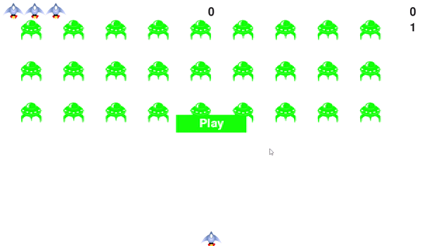

# Alien Spaceship Game in Python

This project is inspired by the book **Eric Matthes - Python Crash Course A Hands-On, Project-Based Introduction to Programming-No Starch Press (2016)**

## Introduction
This is a game created using python pygame.

## Installation

Use the package manager [pip](https://pip.pypa.io/en/stable/) to install pygame.

```bash
pip install pygame
```

## Usage
* Run the game by typing the following command in terminal.
```bash
py alien_invasion.py
```
* Use **left and right arrow keys** to move the spaceship.
* Use **spacebar** to fire the bullet.
* You can modify speed of every component in **settings.py**

## Comments
This project is created for my practice and I would like to thank Eric Matthes for this great book.

## Demo Video
