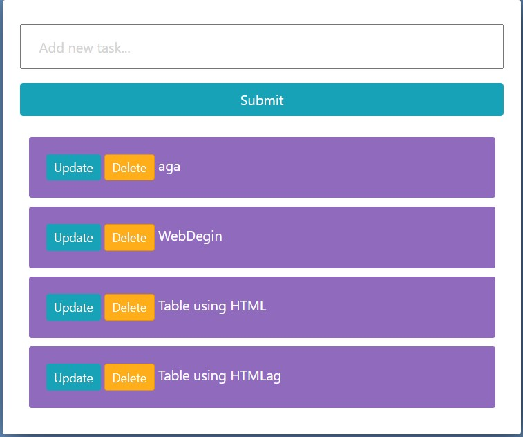

## Preview


## Tech Stack

* Python django


## Installation


```bash
  pip install virtualenv                - to install
  python -m virtualenv "ENVNAME"        - to create
  .\"ENVNAME"\Scripts\activate.bat      - to activate virtual environment
  pip install django                    - to install in virtual env
  pip install -r requirements.txt       - to install all of the Python modules and packages
  cd "TodoList"                         - to move to project file
  python manage.py runserver            - to run project
  ..\"ENVNAME"\Scripts\deactivate.bat   - to deactivate virtual environment
```

Name : Chandan Kushwaha ( todolist ) <br />
GitHub Username : chandanck22 <br />
GitHub Profile URL : https://github.com/chandanck22/
  